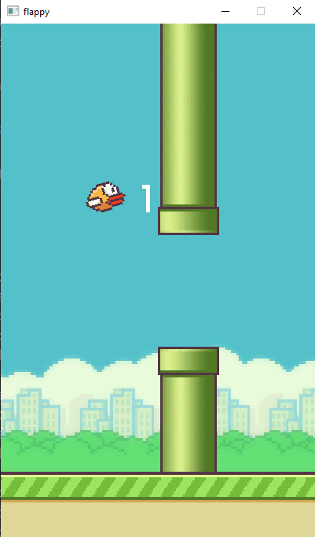

# Flappy Bird in Golang with Raylib

This is a Flappy Bird game built with Golang and Raylib. The game is a tribute to the classic Flappy Bird game that was once a viral sensation.



## How to Play

To play the game, simply press the space bar to make the bird flap its wings and fly. Your goal is to navigate the bird through the obstacles without hitting any of them. Each time you successfully pass through an obstacle, you earn a point.

If you hit an obstacle, the game is over, and you can start again by pressing the space bar.

## Installation

To install and run the game, you need to have Golang and Raylib installed on your computer. Once you have Golang and Raylib installed, follow these steps:

1. Clone the repository to your local machine

```shell
git clone https://github.com/4dot4/Flappy
```
2. Navigate to the project directory

``` shell
cd flappy
```
3. Run the game

```shell
go run . 
```
## Dependencies

The game relies on the following library:

- [Raylib](https://www.raylib.com/): a simple and easy-to-use library for games and interactive applications.

You can install Raylib by following the installation instructions on the [Raylib website](https://www.raylib.com/).

## Contributing

If you would like to contribute to the project, feel free to submit a pull request. I am always open to suggestions and improvements.

## Credits

This game was built by 4dot4 and is based on the original Flappy Bird game by Dong Nguyen. Special thanks to the Raylib library for making game development in Golang so much easier.

## License

This project is licensed under the [MIT License](https://opensource.org/licenses/MIT). Feel free to use and modify the code as you see fit.